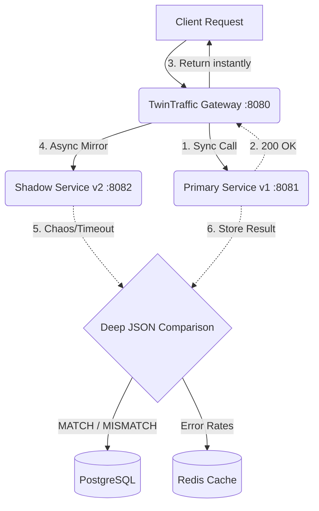

<div align="center">
  <h1>🚦 TwinTraffic <i>(Gateway & Core Services)</i></h1>
  <p><b>A Production-Grade Shadow Traffic Mirroring & Validation System</b></p>

  <p>
    
    
    
    
    
  </p>

  <p>
    Validate your backend deployments safely using real traffic. Mirror production requests, detect deep JSON schema bugs, and compare latencies between microservices—entirely in the background, without ever impacting your users.
  </p>
</div>

---

## ⚡ Everything You Need to Know

This repository contains the backend infrastructure for the **TwinTraffic** platform. It acts as an intelligent API Gateway that automatically splits HTTP traffic, executing deep analytical matching on microservice responses.

### 🌟 Key Features
- **Zero-Impact Mirroring:** Incoming traffic is synchronously forwarded to `v1` while being asynchronously mirrored to `v2` via Spring `@Async` Thread Pools.
- **Deep JSON Diffing:** A custom recursive `ComparisonEngine` scans Jackson response trees to detect schema, value, or array mismatches.
- **Fail-Safe Integrity:** The shadow service (`v2`) can crash, timeout, or return 500s—the client will *never* know. The `v1` response is always guaranteed.
- **Centralized Metrics:** Uses Redis atomic counters for high-speed rate-tracking and PostgreSQL for durable audit logs.
- **Idempotency Headers:** All mirrored requests are stamped with `X-Shadow-Request: true` to prevent side-effect duplication in downstream payment/email services.

---

## 🏗️ Architecture



---

## 📦 Service Topology (Docker Compose)

The entire mesh is orchestrated via a single multi-container `docker-compose.yml`.

1. **`shadow-platform`** (Port `8080`): The brain. Routes traffic, manages the `@Async` execution pool, diffs JSON, and exposes analytical API endpoints.
2. **`v1-mock-service`** (Port `8081`): The control group. Always returns a correct `200 OK` response instantly.
3. **`v2-mock-service`** (Port `8082`): The chaos group. Randomly simulates 40% correct responses, 30% `500 Internal Server Errors`, and 30% extreme latency delays (2–6s).
4. **`postgres`** (Port `5432`): Uses Flyway migrations to store `requests`, `responses`, and `comparisons`.
5. **`redis`** (Port `6379`): Provides fast `INCR` aggregation for the dashboard metrics.

---

## 🚀 Quick Start (Run Locally)

The backend is fully containerized. No Java or Maven installation is required to start the platform.

### 1. Boot the Mesh
```bash
# Pull images, build JARs, and start Postgres + Redis + 3 Spring Boot Apps
docker-compose up --build -d
```

### 2. Verify Health
Wait 15 seconds for Spring Boot instances to bind, then check:
```bash
curl http://localhost:8080/actuator/health
```

### 3. Blast some Traffic 💥
Fire a request into the Gateway. It will hit **v1** synchronously, mirror to **v2** asynchronously, and log the comparison.
```bash
curl -X POST http://localhost:8080/proxy \
  -H "Content-Type: application/json" \
  -d '{
    "endpoint": "/api/payments",
    "method": "POST",
    "payload": {"userId": 42, "amount": 100},
    "headers": {}
  }'
```

---

## 📊 Analytics API Endpoints

Once you've fired a few requests, explore the analytics engine:

| Method | Endpoint | Description |
|---|---|---|
| `GET` | `/metrics` | View overall system stats (Total Requests, Mismatch %, Avg Latency Diff). |
| `GET` | `/requests` | Paginated audit log of all historical API calls. |
| `GET` | `/requests/{id}` | Deep dive into a specific request, showing full HTTP bodies and the exact `diff_details` if a mismatch occurred. |
| `POST` | `/replay/{id}` | Re-execute a historical request through the entire pipeline. |

*(Interactive Swagger UI available at `http://localhost:8080/swagger-ui.html`)*

---

## 💻 Code Structure highlights

- **`config/AsyncConfig.java`**: Customizes the `ThreadPoolTaskExecutor` to prevent thread starvation during massive shadow spikes.
- **`config/WebClientConfig.java`**: Configures reactive, non-blocking HTTP pooling to the downstream microservices.
- **`service/ComparisonEngine.java`**: Leverages Jackson's `ObjectMapper.readTree()` to execute dynamic, structure-aware JSON comparisons.

---

## 🌐 Showcase UI 

This backend powers the **TwinTraffic Interactive Showcase**, a premium React/Vite dashboard. [Click here to view the Frontend Repository](https://github.com/RisheekShukla/TwinTraffic).
